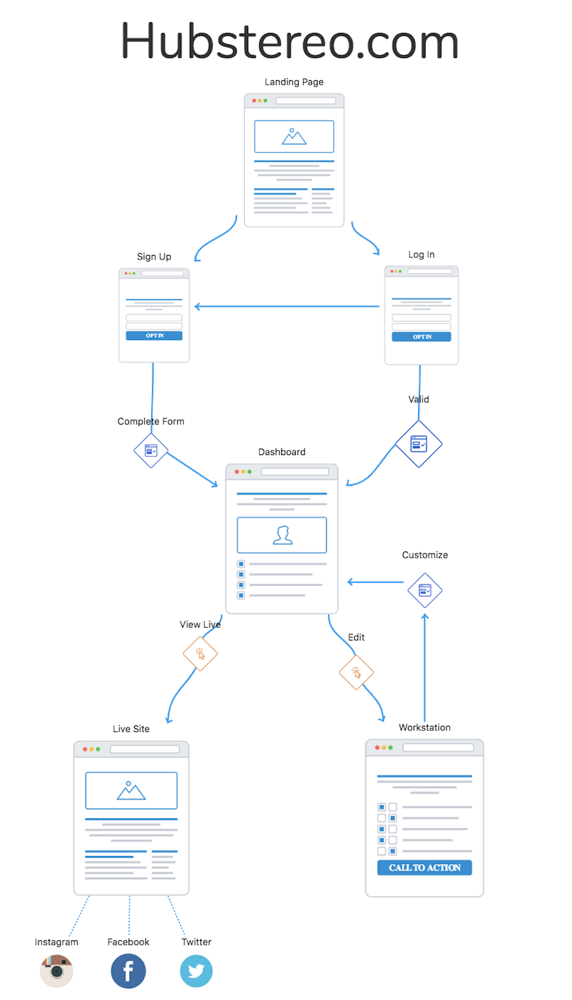
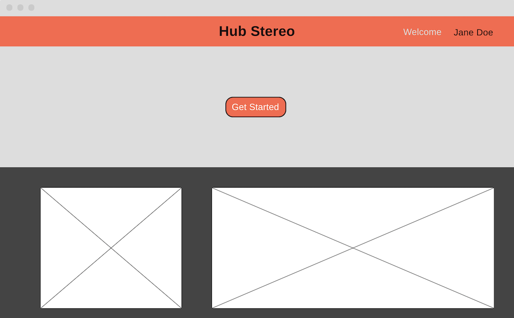
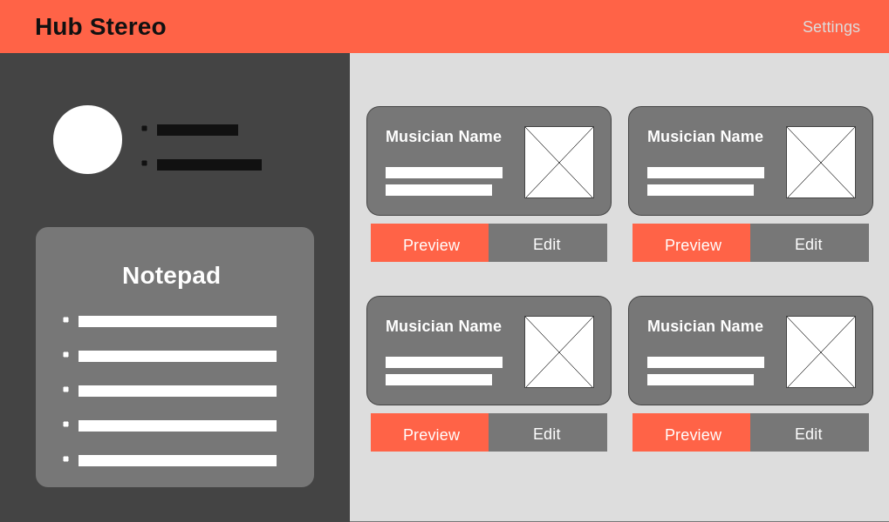
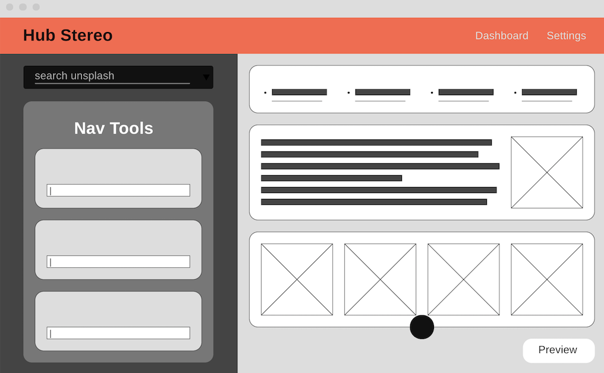
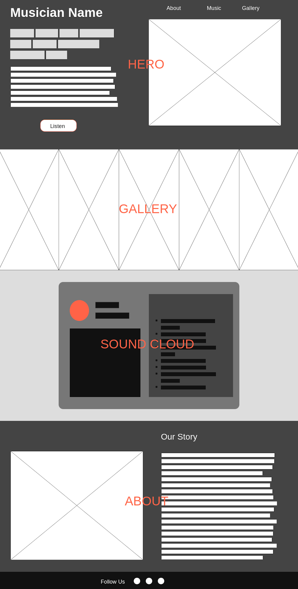

# Hubstereo
### An easy to use website builder for musicians
#### MVP
- Create an account
- Login/Logout
- Full CRUD notepad on the dashboard
- Create personalized websites (section by section)
- Save changes that persist to the backend
- Preview website in progress
- Once completed; newly created website can be viewed at https://Hubstereo.herokuapp.com/UserWebsiteName

#### Not Included
- MVP will not give the user the ability to deploy their website with a personalized domain name
- MVP will not give the user the ablitity to create an online store
- MVP will not give the user the ability to create multiple websites
- MVP will not give the users more than one preset template to start from 

#### Technologies Utilized

| Languages     | Frameworks    | Libraries     | Databases     | Other         | 
| ------------- | ------------- | ------------- | ------------- | ------------- |
| Javascript    | Bootstrap     | React.js      | Firebase      | Heroku        |
| Java          | Springboot    | Redux         | PostgreSQL    | React-Router  |  
| CSS           |               |               |               | EditorJs      |
| HTML          |               |               |               | Reactstrap    |
| SQL           |               |               |               |               |

#### Implementation of Java & Springboot
- The notepad in the dashboard page will run on java and springboot
- Everything else will be done with React and Firebase
    
#### Pages 
- Landing 
- Dashboard
- Workstation
- Preview
- Musician Website

# Navigation


# The Landing Page

### This page showcases a few examples of sites made with Hubstereo in the past. It also prompts users to login/signUp and get started.


# The Dashboard

### For the MVP, this page will only allow the user to update personal info, add a profile picture, and edit or preview their page.


# The Workstation

### This page features the two most important components: Toolbox & Display. 


## Components
### Builder
- Holds the two main components: Toolbox & Display
- Stretch: Incorporate three buttons that adjust the dimentions of the display: Desktop, Tablet, and Mobile. This will give the user an idea of what thier website  will look like on different devices.

### Display
- Contains Sections
- Contains a button to the left of every section that allows users to edit individual sections
- Contains a button to add a new seciton after every section
- Contains a link to the Preview page
- Stretch: Users can rearrange component by dragging them.

#### Add Section Button 
- When clicked, this button opens up a menu that allows the user to select the type of section they want to create.
- MVP Section Types are as follows : Nav, Hero, SoundCloud, About, and Gallery. (these are subject to change).
- Stretch: incorporate other section types: Tour Dates, News, Videos, Ect...

#### Sections
- Contain Section Units that match the section type
- Render dynamically based on user input via the Toolbox

#### Section Units
- Individual textboxes, IMG tags, Embeded data, Ect.
- This fields will have a default value that is determined by the template. (In the case of the MVP there is only one template)
- Users will have the avility to edit these values with the Toolbox. Values should render dynamically based on user input.

### Toolbox
- Contains tools that match the section type
- Tools change when the user clicks "edit" on another section or adds a different type of section.
- Stretch: Add a the capability to search for images via the unsplash API. User should be able to easily use these as background images.

#### Tools
- Individual inputs that make live edits to the selected section.
- Stretch: make inputs more flexible by using Editorjs.io

# The Preview / Musician Website

### This is the final product. The only difference bewtween the preview and the live site page (componentwise...) is a publish button on the preview page.


###### © Seth Ortiz 2019

# User Stories

## Landing Page

__#1__
```
As a user
When I visit the route route
I see a "get started" button and examples of sites created with hubstereo
```
__#2__
```
As a user
When I click the "get started" button
I am promted with a loggin/sign up option
```
__#3__
```
As a user
If I sign up with valid credentials
I am redirected to /dashboard/:userId
```
__#4__
```
As a user
If I enter valid credentials into the login form & submit
I am redirected to /dashboard:userId
```
__#5__
```
As a user that has already logged in
When I click on the "get started" button
I am redirected directly to the dashboard
```

## Dashboard

__#1__
```
As a user
When I visit /dashboard/:userId
I should see a profile section on the upper left had corner that gives the option to add a picture and bio.

```
__#2__
```
As a user
when I visit /dashboard/:userId
I should see a notepad where I can create new notes, edit existing notes, and delete notes.
```

__#3__
```
As a user
When I visit /dashboard/:userId
I should see a list of all my websites.
```

__#4__
```
As a user
When I click the "edit" button on one of my websites
I should be redirected to /worstation/:userId/:websiteId
```
## Workstation

__#1__
```
As a user
When I visit /worstation/:userId/:websiteId
I should see a Toolbox and a Display

```

__#2__
```
As a user
When I visit /worstation/:userId/:websiteId
I should be able to easily create a new section and edit it with the the tool box.

```

__#3__
```
As a user
When I visit /worstation/:userId/:websiteId
Should see the display update when I make edits using the toolbox

```

__#4__
```
As a user
When I visit /worstation/:userId/:websiteId
I should see an options to preview and publish my website
```

__#5__
```
As a user
When I click the "preview" button
I should be redirected to /preview/:userId/:websiteId
```

__#6__
```
As a user
When I click the "publish" button
I should be redirected to /dashboard/:userId/ and notified that my site was published
```

## Preview

__#1__
```
As a user
When I visit /worstation/:userId/:websiteId
I should see and Toolbox and a Display

```

__#2__
```
As a user
When I visit /worstation/:userId/:websiteId
I should be able to easily create a new section and edit it with the the tool box

```

## Musician Website

__#1__
```
As a user
When I visit /userWebsiteName
I should see the site that I created 

```

__#2__
```
As a user
When I visit /userWebsiteName
I should be able to listen to my music, read my about section, view my pictures, and click links that redirect me to my social media

```